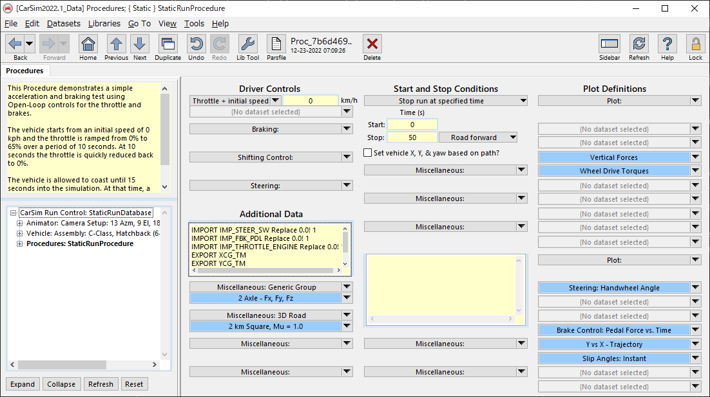
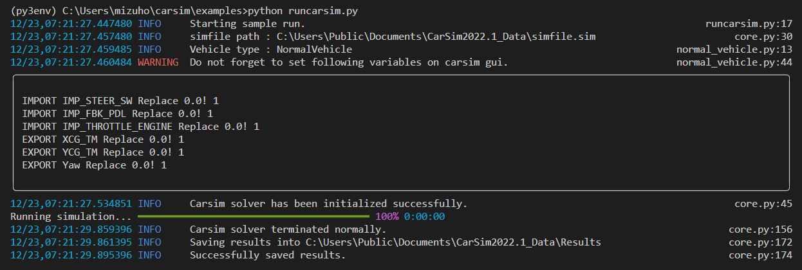
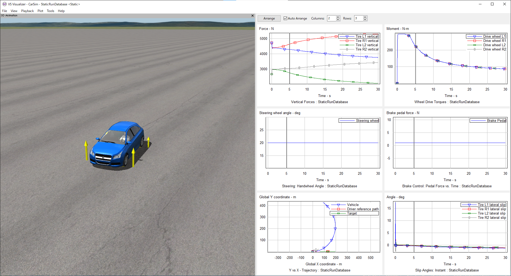

# pycarsimlib
An easy-to-use wrapper library to call carsim solver from python script.

# Environmental setup

1. `cd /path/to/workingdir`
1. `git clone https://github.com/MizuhoAOKI/pycarsimlib.git`

# Install pycarsimlib from pip
You can also install pycarsimlib easily with pip.

`pip install pycarsimlib`

# Run a sample script
1. Launch carsim software.
    - Make a dataset in which vehicle does not run.
    - Edit procedures and declare import and export variables with "Additional Data" textbox. ex.
        ```
        IMPORT IMP_STEER_SW Replace 0.0! 1
        IMPORT IMP_FBK_PDL Replace 0.0! 1
        IMPORT IMP_THROTTLE_ENGINE Replace 0.0! 1
        EXPORT XCG_TM
        EXPORT YCG_TM
        EXPORT Yaw
        ```
        
    - After you finish editing gui, Press "Run Math Model" button to generate a simulation setting file (simfile.sim)

1. Change `CARSIM_DB_DIR` value in examples/runcarsim.py according to your environment. 

    ex. `r"C:\Users\Public\Documents\CarSim2022.1_Data"`
1. Run the script.
    ```
    $ cd examples
    $ python runcarsim.py
    ```
    
1. Press "Video + Plot" button on carsim gui to visualize simulation results.

